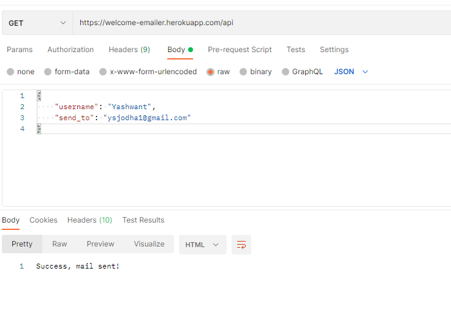
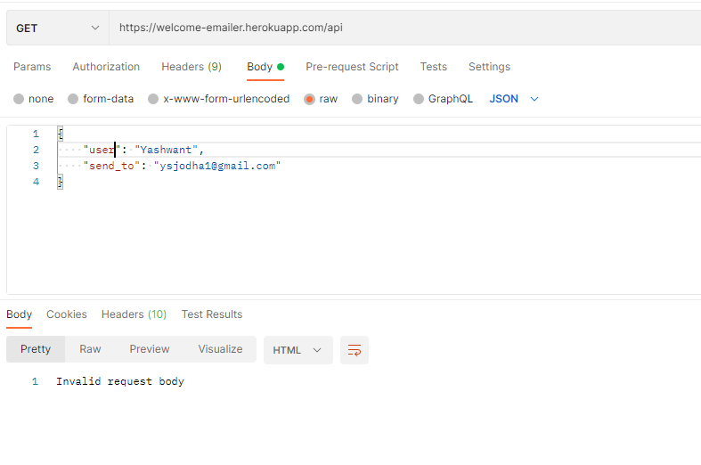
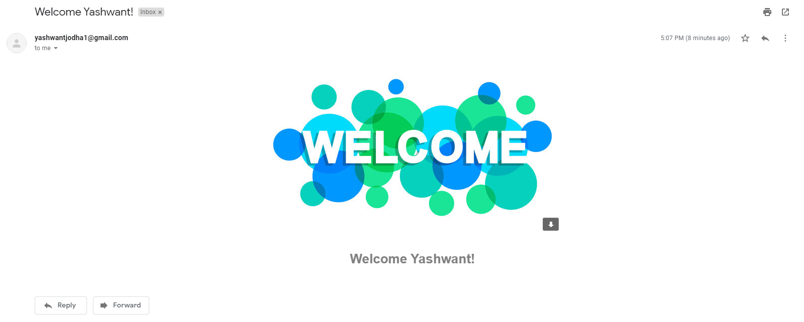

# emailer-api

This app is hosted here [Welcome-emailer](https://welcome-emailer.herokuapp.com/api)

The api works on both GET/POST requests. The Request body should contain "username" and "send_to" fields.
This Django app uses Gmail server for sending emails.

1. GET/POST request with correct fields
    
2. GET/POST request with incorrect fields
    

Welcome Email:
    